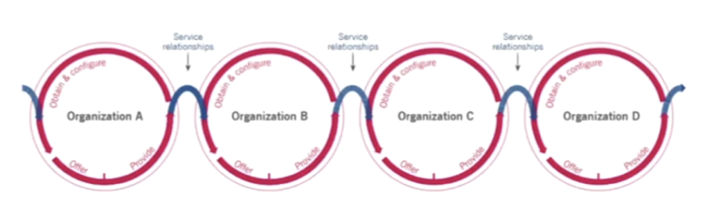
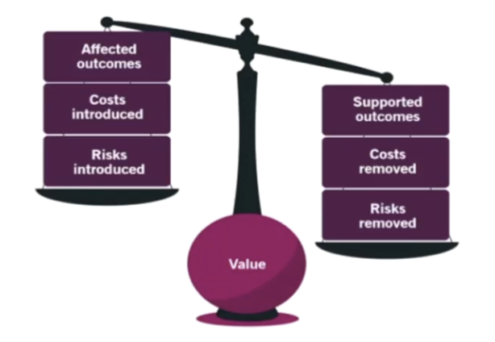
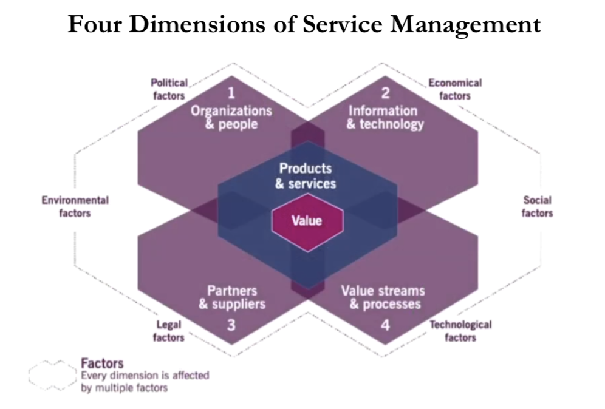

# ITIL 4

## To remember or recall...

Service Management is HOW an organization generates value through its services to its customers (stakeholders)

### Value
> Is the perceived benefits, usefulness and importance of something.

* Providers and consumers co-create value.
* Value is subjective. For example, if we take the case of 2 people studying Agile... One can be doing it just to obtain the certification, the other with the aim of learn and improve her work.

### Organization
> Is a person or group of people that has its own functions with responsibilities, authorities and relationships to achieve its objectives. 

* Different size and complexity.
* Various legal entities.
* Can be one person or a whole Company.

### Service Providers

An organization that provides services. Can be internal (like the own company's Help Desk) or external (like AWS)

### Service Consumers

People who consume our services.

1. Customer: person who defines the requirements for a service and takes responsibility for the outcomes of service consumption
2. User: person who uses the services
3. Sponsor: person who approves budget for service consumption

### Other Stakeholders
Outside consumers and providers, we also have..

1. Shareholders
2. Employees 
3. Community (including Government)
4. Partners and suppliers

### Services and Products

> A service is a means of enabling value co-creation by facilitating outcomes that customers want to achieve, without the customer having to manage specific costs and risks. 

The services that an organization provides are based on one or more of its products.

> A product is a configuration of resources created by the organization with the aim of offer value to the consumer.

### Service offering

> A service offering is the description of one or more services designed to address the needs of a target consumer group.

Examples:
* Goods: generally tangible things
* Access to Resources: like access to a AWS 
* Service Actions: like outsourcing help desk

### Service Relationships

Created between 2 or more organizations to co-create value.
In a Service Relationship, organizations will take the role of service provider or service consumer. Remember that an organization is, usually, provider and consumer of x-services (other services).

> A service relationship is a cooperation between a service provider and service consumer

It includes:
* Service provision: activities performed by an organization to provide services
* Service consumption: activities performed by an organization to consume services
* Service relationship management: joint activities performed by a service provider and a service consumer top ensure continual value co-creation based on agreed and available service offerings

### Service relationship model

We take the service of a service provider and reconfigure it to create a new service. 

### Outcomes, Costs and Risks

* Outcomes requires requires resources (costs) and are associated with risks.
* Service providers help their consumers taking some of the associated risks and costs.

### Output and outcome

> Output is a tangible or intangible deliverable of an activity.

> Outcome is a result for a stakeholder enabled by one or more outputs

* Output of studying for ITIL 4 certification would be getting the certificate.
* What is the main value? Outcome which would be getting a new job and a better income. 

### Service cost

> Cost is the amount of money spent on a specific activity or resource.

Consumer's perspective...
* Costs removed from the consumer by the service
* Costs imposed on the consumer by the service

Example: AWS... I don't have to pay for virtual machines, etc, but I pay to AWS for its usage.

Provider's perspective... Cost of fulfilling the service requirements needed by the consumer. 

Example: AWS... Has to pay for infrastructure, employees, etc.

### Service Risk

Risk is a possible event that may cause harm or loss or make it more difficult to achieve objectives. 

Risk can be used to measure the probability of positive outcomes and negative outcomes.

Types of risks for consumers...
* Risks removed from a consumer by the service
* Risks imposed on the consumer by the service

What can consumers do to help reduce the risk:
* Participate in the gathering of requirements for the service
* Communicate the critical success factor clearly
* Make sure the service provider has the necessary resources of the consumers throughout the service relationship. 

### Utility and Warranty

> Utility is the functionality offered by a product or service to meet a particular need. Summarized as what the service does. Determine whether a service is fit for purpose.

> Warranty is the assurance that a product or service will meet agreed requirements. Summarized as how the service performs. Determine whether a service is fit for use. 

---

### Four Dimension of Service Management

