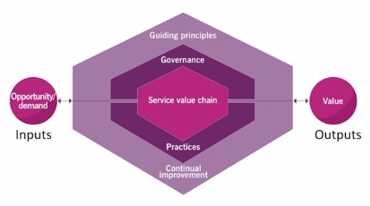

# ITIL 4

## To remember or recall...

Service Management is HOW an organization generates value through its services to its customers (stakeholders)

### Value
> Is the perceived benefits, usefulness and importance of something.

* Providers and consumers co-create value.
* Value is subjective. For example, if we take the case of 2 people studying Agile... One can be doing it just to obtain the certification, the other with the aim of learn and improve her work.

### Organization
> Is a person or group of people that has its own functions with responsibilities, authorities and relationships to achieve its objectives. 

* Different size and complexity.
* Various legal entities.
* Can be one person or a whole Company.

### Service Providers

An organization that provides services. Can be internal (like the own company's Help Desk) or external (like AWS)

### Service Consumers

People who consume our services.

1. Customer: person who defines the requirements for a service and takes responsibility for the outcomes of service consumption
2. User: person who uses the services
3. Sponsor: person who approves budget for service consumption

### Other Stakeholders
Outside consumers and providers, we also have..

1. Shareholders
2. Employees 
3. Community (including Government)
4. Partners and suppliers

### Services and Products

> A service is a means of enabling value co-creation by facilitating outcomes that customers want to achieve, without the customer having to manage specific costs and risks. 

The services that an organization provides are based on one or more of its products.

> A product is a configuration of resources created by the organization with the aim of offer value to the consumer.

### Service offering

> A service offering is the description of one or more services designed to address the needs of a target consumer group.

Examples:
* Goods: generally tangible things
* Access to Resources: like access to a AWS 
* Service Actions: like outsourcing help desk

### Service Relationships

Created between 2 or more organizations to co-create value.
In a Service Relationship, organizations will take the role of service provider or service consumer. Remember that an organization is, usually, provider and consumer of x-services (other services).

> A service relationship is a cooperation between a service provider and service consumer

It includes:
* Service provision: activities performed by an organization to provide services
* Service consumption: activities performed by an organization to consume services
* Service relationship management: joint activities performed by a service provider and a service consumer top ensure continual value co-creation based on agreed and available service offerings

### Service relationship model

We take the service of a service provider and reconfigure it to create a new service. 

### Outcomes, Costs and Risks

* Outcomes requires requires resources (costs) and are associated with risks.
* Service providers help their consumers taking some of the associated risks and costs.

### Output and outcome

> Output is a tangible or intangible deliverable of an activity.

> Outcome is a result for a stakeholder enabled by one or more outputs

* Output of studying for ITIL 4 certification would be getting the certificate.
* What is the main value? Outcome which would be getting a new job and a better income. 

### Service cost

> Cost is the amount of money spent on a specific activity or resource.

Consumer's perspective...
* Costs removed from the consumer by the service
* Costs imposed on the consumer by the service

Example: AWS... I don't have to pay for virtual machines, etc, but I pay to AWS for its usage.

Provider's perspective... Cost of fulfilling the service requirements needed by the consumer. 

Example: AWS... Has to pay for infrastructure, employees, etc.

### Service Risk

Risk is a possible event that may cause harm or loss or make it more difficult to achieve objectives. 

Risk can be used to measure the probability of positive outcomes and negative outcomes.

Types of risks for consumers...
* Risks removed from a consumer by the service
* Risks imposed on the consumer by the service

What can consumers do to help reduce the risk:
* Participate in the gathering of requirements for the service
* Communicate the critical success factor clearly
* Make sure the service provider has the necessary resources of the consumers throughout the service relationship. 

### Utility and Warranty

> Utility is the functionality offered by a product or service to meet a particular need. Summarized as what the service does. Determine whether a service is fit for purpose.

> Warranty is the assurance that a product or service will meet agreed requirements. Summarized as how the service performs. Determine whether a service is fit for use. 

---

### Four Dimension of Service Management

#### Organization and People

* Ensures the way an organization is structured and managed is well defined and supports its overall strategy.
* People need to update their skills and competencies.
* Everyone should have an understanding of their involvement towards creating value for the organization, its customers, and other stakeholders.

#### Information and Technology

* Includes the information and knowledge necessary for the management of services, as well as the technologies required.

#### Partners and suppliers

* Includes an organization’s relationships with other organizations that are involved in the services.
* It also includes contracts and other agreements between the organization and its partners or suppliers.
* Partners and supplies generally fall into 3 forms of cooperation:
   - Goods Supply: Sells goods to an organization usually with a contract or invoice
   - Service Delivery: Delivers service to an organization such as cloud computing, usually with an agreement
   - Service Partnership: Value co-creator that works with the organization to supply the service to a consumer, such as outsource IT.

* Factors to consider when using suppliers include:
  - Strategic Focus: Does the company desire to outsource and
focus on it’s core
  - Corporate culture: Some companies choose to hire outside supplier’s to reduce risk
  - Resource Scarcity: If a company require resources from outside the organization
  - Cost Concerns: It may be more cost efficient to hire outside providers
  - Subject matter expertise: It might be less of a risk to hire outside expertise than to develop experts in house
  - External constraints: Regulations may dictate hiring external suppliers, such as external auditors
  - Demand patterns: Variation of customers usages may require external suppliers

#### Value Streams and Processes

* Concerned with how the many parts of the organization working in a unified and coordinated way to enable value creation through products and services.

>  Value stream: “A series of steps an organization undertakes to create and deliver products and services to consumers.”

> Process: “A set of interrelated or interacting activities that transform inputs into outputs.”

#### External Factors

* Many external factors can exhibit high degrees of volatility and uncertainty and impose constraints on how the service provider can work.

* Frameworks such as the PESTLE (or PESTEL) model are used. PESTLE is an acronym for the political, economic, social, technological, legal, and environmental factors that constrain or influence how a service provider operates.

---

### ITIL Service Value System

Describes how all the components and activities of the company works together as a system to create value.

It tries to prevent organizational silos, like being resistance to change.

* Guiding principles: Recommendations that can guide a company in all circumstances, regardless of changes in its goals, strategies, type of work, or management structure.
* Governance: The means by which an organization is manage.
* Service value chain: A set of interrelated activities that an organization performs to deliver a valuable product or service.
* Practices: Sets of company resources designed for performing work or accomplishing an objective.
* Continual improvement: A repeated company activity performed at all levels to ensure that a company performance continually meets it’s stakeholders’ expectations.

---

* Uses opportunity and demand as an inputs and outputs.
* Opportunities are options or possibilities to add value stakeholders.
* Demand are the need or desire for products and services from a internal and external customers.

#### Guiding principles

* Guides a company in all circumstances.
* A guiding principle is universal and enduring.
* These principles are used in many different frameworks including Agile, DevOps, and COBIT.

**Seven Guiding Principles**
* **Focus on value:** all actions every person in the company does should be focus on how we deliver value. Value can be revenue, customer loyalty, lower cost, growth opportunities. We should know how consumers use the service. 

* **Start where you are:** we should check what we have and how we can make it better as a starting point. Understand that sometimes nothing from the current state could be re-used.

* **Progress iteratively with feedback:** organize work into smaller, manageable sections and receive feedback of each one. Change and ask for feedback and iterate. We will discover issues earlier and improve quality.
Use a minimum viable product , which is a version of the product that allows for the maximum amount of learning with the least effort.

* **Collaborate and promote visibility:** right people in the right job. Inclusion is better than exclusion.
Collaborate with all stakeholders to understand what they are expecting from the service.
Organization need to understand work in progress and identify bottlenecks.

* **Think and work holistically:** service as a whole. Customers served as consumers see the service delivery entirely, not as parts (they judge as the whole).

* **Keep it simple and practical:** if we are doing something that does not provide value to the service we should eliminate it. Unnecessary work is doing things more complex.
Fewer steps.

* **Optimize and automate:** optimization leads to more efficient and effective work, automation reduces costs which can lead to higher value.
We first optimize and then automate.

### Governance

Every company is managed by a governing body, i.e. a person or group of people who are accountable for the performance and compliance of the company.

It should...
* Evaluate
* Direct
* Monitor

### Service value chain

This replaces the Service Lifecycle System of ITIL 3.

The six value chain activities are:
Demand, products and services are NOT part.

* Plan
* Improve
* Engage
* Design and Transition 
* Obtain/Build
* Deliver and Support

The activities represent the stages an organization takes in the creation of value. Each activity converts inputs into outputs.

Remember we are always improving... We improve Plan, How we engage, how we deliver...

#### Plan

Ensures a shared understanding of the vision, current status, and improvement direction for all four dimensions and all products and services across the organization.

Everyone understand what we are doing and how we are going to do it.

All activities are interrelated. Outputs of one become the inputs of the next. 

#### Improve

Making certain continual improvement of products, services, and practices across all value chain activities and the four dimensions of service management.

#### Engage

To provide a good understanding of stakeholder needs, transparency, and continual engagement and good relationships with all stakeholders.

#### Design and Transition

To ensure that products and services continually meet stakeholder expectations for quality, costs, and time to market.

#### Obtain and Build

The purpose of the obtain/ build value chain activity is to ensure that service components are available when and where they are needed, and meet agreed specifications.

#### Deliver and Support

The purpose of the deliver and support value chain activity is to ensure that services are delivered and supported according to agreed specifications and stakeholders’ expectations.

---

### Continual Improvement Model

